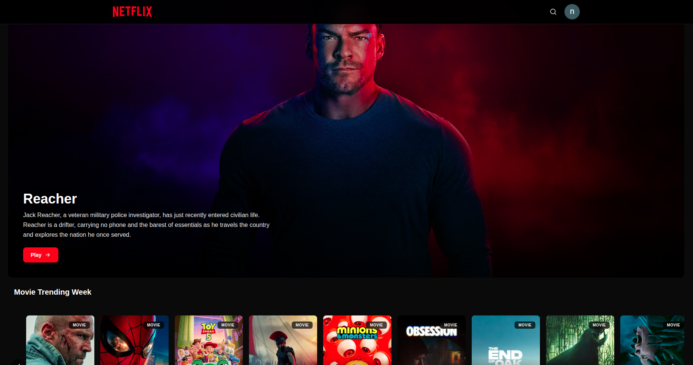

# 🎬 Movie

A movie and TV show website built with Next.js.

## Preview

<p align="center">
  
</p>

## Live Demo

https://movie-niraj21.vercel.app/movies/

## Features

- Browse movies
- Browse TV shows
- Trending movies
- Trending TV shows
- Movie and TV show details
- Ratings
- Responsive design
- User authentication
- Local data storage

## Tech Stack

- Next.js
- React
- TypeScript
- Tailwind CSS
- NextAuth
- Neon
- IndexedDB

## Run Locally

Clone the repository:

```bash
git clone https://github.com/Nirajsah17/movie.git
```

Go to the project folder:

```bash
  cd movie
```

Install dependencies:

```bash
  npm install
```

Environment Variables

Create a `.env.local` file in the root directory:

```bash
DATABASE_URL=
NEXTAUTH_SECRET=
BASE_URL=
TMDB_API_KEY=
GOOGLE_CLIENT_ID=
GOOGLE_CLIENT_SECRET=
NEXTAUTH_SECRET=
NEXTAUTH_URL=
DATABASE_URL=
```


npm run dev

```bash
  npm run dev
```

## Links

* Live demo [Link](https://movie-niraj21.vercel.app/movies/)
* GitHub: https://github.com/Nirajsah17/movie


## Author 

Niraj Kumar Sah


If you like the project, consider giving it a star.


